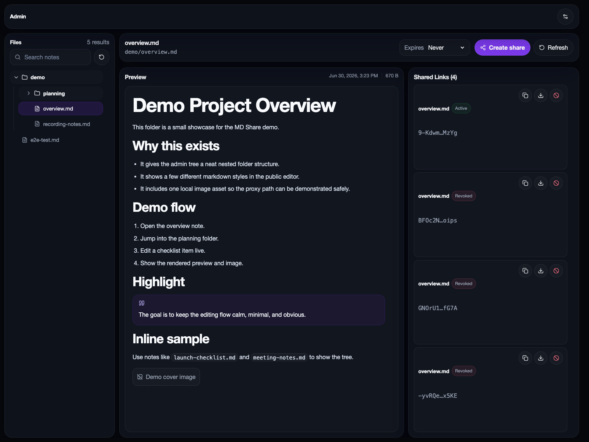
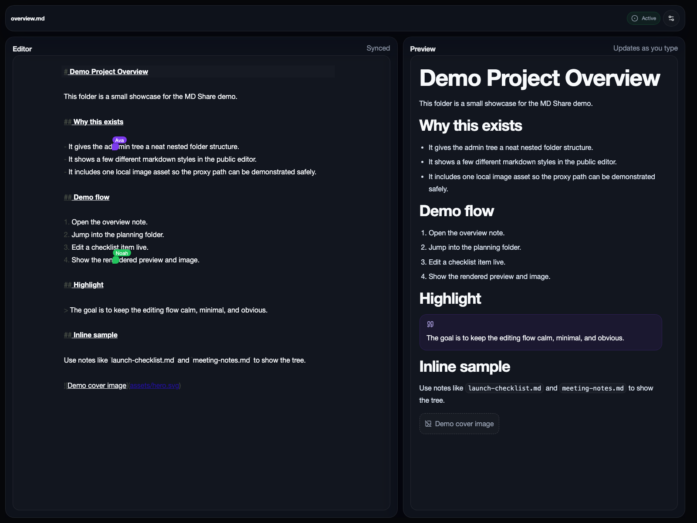

# 📄 MD Share

Collaborate on your Markdown notes in real time from an Obsidian vault, a local folder, or a remote share link.

## Features

- 🔗 Share a single Markdown note with a tokenized public link
- ✍️ Edit live in the browser with collaborative cursors and participant names
- 👀 Preview rendered Markdown beside the editor
- 🖼️ Proxy local images safely from the mounted notes folder
- 🗂️ Manage notes, shares, and exports from a separate admin UI
- 🔒 Keep the admin surface private while exposing only the public editor
- 🐳 Run everything locally with Docker Compose

## Local URLs

- Admin UI: `http://localhost:3020`
- Public editor: `http://localhost:3021`

## Screenshots

The admin view keeps the file tree, preview, and share controls in a single desktop layout.



The public view shows live collaboration with multiple cursors and a rendered preview beside the editor.



## Quick Start

Use the installer script for the fastest setup:

```bash
curl -fsSL https://raw.githubusercontent.com/marcelrsoub/md-share/main/install.sh | bash
```

The installer asks for your notes folder path, writes a local env file, and starts Docker Compose.

```bash
curl -fsSL https://raw.githubusercontent.com/marcelrsoub/md-share/v0.0.2/install.sh | bash
```

To work from a local clone instead, review the files first:

```bash
git clone https://github.com/marcelrsoub/md-share.git
cd md-share
bash install.sh
```

## Notes Folder

The mounted notes directory can be:

- an Obsidian vault
- a plain folder of Markdown files

See [`.env.example`](.env.example) for the supported variables.

## Docker Compose

- [`docker-compose.obsidian.yml`](docker-compose.obsidian.yml) is the supported install path for mounting an existing notes folder.
- [`docker-compose.yml`](docker-compose.yml) is a simple local/dev compose file that mounts `./notes` and `./data` from the repo root.

## Cloudflare Tunnel

Point Cloudflare Tunnel at the public editor on `3021` and keep the admin UI private.

```bash
cloudflared tunnel --url http://localhost:3021
```

For a named tunnel, set `PUBLIC_BASE_URL` to your public hostname and route the tunnel to the same `3021` service.

## Safety

- Only `.md` files inside your mounted vault can be shared.
- Public links only open the note behind that token.
- Keep the admin UI on a trusted network or behind your own auth.
