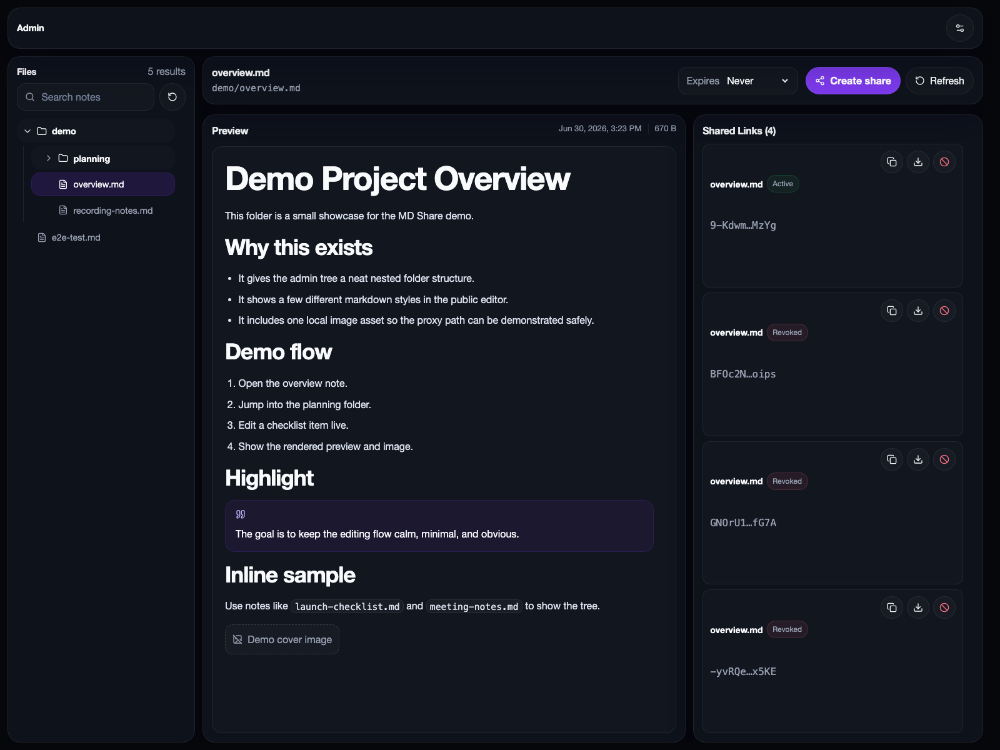
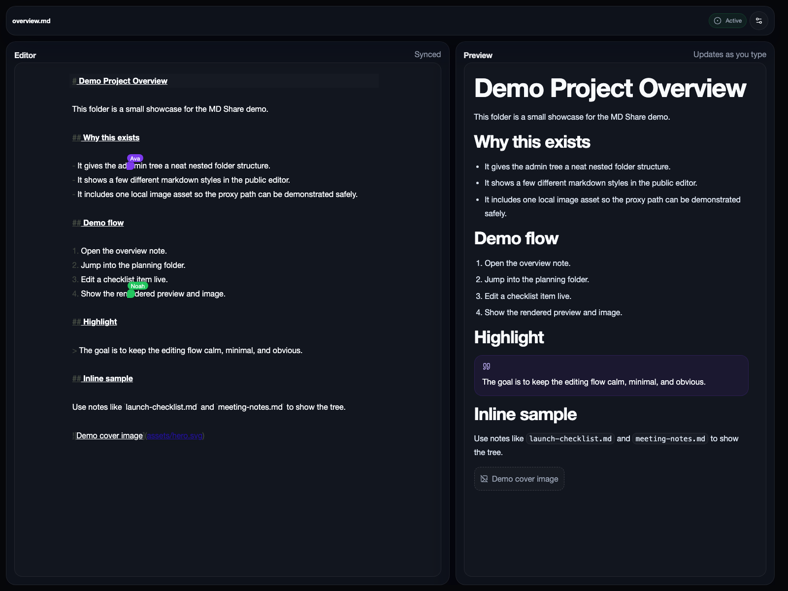

#  MD Share

## Collaborate in real time on your Obsidian notes

Turn a Markdown note into a focused, shareable workspace. MD Share lets you open one note in the browser, invite collaborators, and edit together live, while your vault stays self-hosted and under your control.

## Share the note, not your whole vault

MD Share is built for the moment when a note needs input from someone else. Choose a note, create a private link, and bring collaborators into the browser without exposing your entire Obsidian vault.

### What you get

- 🔗 Create a private, tokenized link for one Markdown note
- ✍️ Collaborate live in the browser with participant names and cursors
- 👀 Keep the rendered Markdown preview close to the editor
- 🖼️ Display local note images without exposing raw filesystem paths
- 🗂️ Manage notes, links, and exports from a focused admin workspace
- 🔒 Keep your vault and admin surface private
- 🐳 Run the whole experience locally with Docker Compose

## Local URLs

- Admin UI: `http://localhost:3020`
- Public editor: `http://localhost:3021`

## Screenshots

The admin view keeps the file tree, preview, and share controls in a single desktop layout.



The public view shows live collaboration with multiple cursors and a rendered preview beside the editor.



## Get started in minutes

Use the installer script for the fastest setup:

```bash
curl -fsSL https://raw.githubusercontent.com/marcelrsoub/md-share/main/install.sh | bash
```

The installer asks for your notes folder path, writes a local env file, and starts Docker Compose.

```bash
curl -fsSL https://raw.githubusercontent.com/marcelrsoub/md-share/v0.1.0/install.sh | bash
```

To work from a local clone instead, review the files first:

```bash
git clone https://github.com/marcelrsoub/md-share.git
cd md-share
bash install.sh
```

### React Kanban dependency

Kanban shares consume the generated `obsidian-react-kanban` library from the pinned `0.2.0` release archive over HTTPS. For local library development, temporarily replace that dependency with a `file:` reference to a sibling checkout and regenerate `package-lock.json` before switching back to the pinned archive for deployment.

## Notes Folder

The mounted notes directory can be:

- an Obsidian vault
- a plain folder of Markdown files

See [`.env.example`](.env.example) for the supported variables.

## Docker Compose

- [`docker-compose.obsidian.yml`](docker-compose.obsidian.yml) is the supported install path for mounting an existing notes folder.
- [`docker-compose.yml`](docker-compose.yml) is a simple local/dev compose file that mounts `./notes` and `./data` from the repo root.

## Cloudflare Tunnel

Point Cloudflare Tunnel at the public editor on `3021` and keep the admin UI private.

```bash
cloudflared tunnel --url http://localhost:3021
```

For a named tunnel, set `PUBLIC_BASE_URL` to your public hostname and route the tunnel to the same `3021` service.

## Safety

- Only `.md` files inside your mounted vault can be shared.
- Public links only open the note behind that token.
- Keep the admin UI on a trusted network or behind your own auth.
